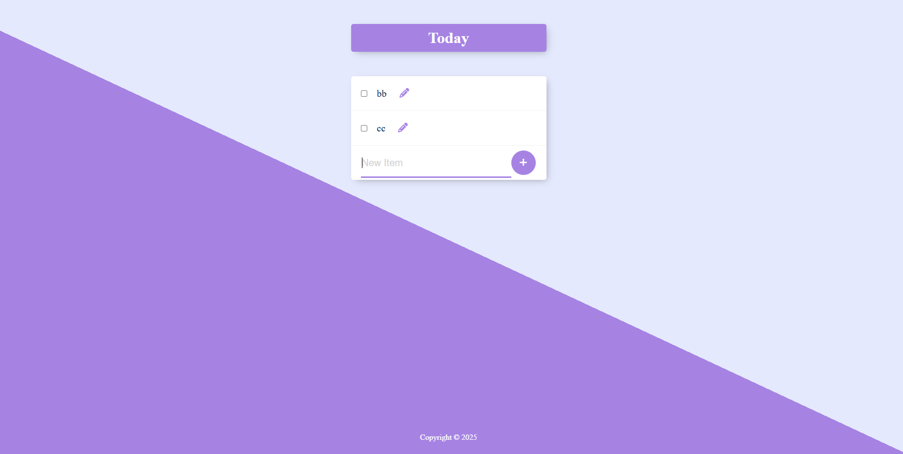

# Permalist

[]()

A simple permalist app to keep track of what you have to do today. Add, edit, and delete your daily tasks with a clean interface and persistent storage.

---

## ✨ Features

- **Add Tasks:** Quickly add new tasks to your daily list.
- **Edit Tasks:** Update task titles directly from the list.
- **Delete Tasks:** Remove tasks with a single click.
- **Persistent Storage:** All tasks are stored in a PostgreSQL database.
- **Responsive Design:** Works on desktop and mobile.

---

## 🛠️ Technologies Used

- **Backend:**
  - Node.js
  - Express
  - body-parser
  - pg (PostgreSQL client)
- **Frontend:**
  - EJS (templates)
  - HTML/CSS
  - JavaScript
- **Other:**
  - Git for version control

---

## 🚀 Installation

1. **Clone the repository:**

   ```bash
   git clone https://github.com/Antoinekoe/permalist.git
   cd permalist
   ```

2. **Install dependencies:**

   ```bash
   npm install
   ```

3. **Set up your PostgreSQL database:**

   - Create a database named `permalist`.
   - Create the table:

     ```sql
     CREATE TABLE items (
       id SERIAL PRIMARY KEY,
       title VARCHAR(255)
     );
     ```

4. **Configure your PostgreSQL password:**

   - In `index.js`, set your PostgreSQL password in the config:
     ```js
     password: "YOUR_PASSWORD_HERE";
     ```

5. **Start the server:**
   ```bash
   nodemon index.js
   ```
   The app will be available at `http://localhost:3000`.

---

## 🗂️ Project Structure

```
8.6 Permalist Project/
├── public/
│   ├── assets/
│   │   └── icons/
│   │       ├── check-solid.svg      # Check icon for editing
│   │       └── pencil-solid.svg     # Pencil icon for editing
│   └── styles/
│       └── main.css                 # Main stylesheet for the app
├── views/
│   ├── partials/
│   │   ├── footer.ejs               # Footer partial template
│   │   └── header.ejs               # Header partial template
│   └── index.ejs                    # Main EJS template for the homepage
├── index.js                         # Main backend server file (Express app)
├── LICENSE
├── package.json                     # npm config file
├── package-lock.json                # npm lock
├── queries.sql                      # SQL queries
└── README.md                        # Project documentation
```

---

## 🤝 How to Contribute

Contributions are welcome!

1. **Fork the repository.**
2. **Create a branch for your feature or fix:**
   ```bash
   git checkout -b feature/my-new-feature
   # or
   git checkout -b bugfix/bug-fix
   ```
3. **Make your changes and commit with a clear message.**
4. **Push your branch to your fork:**
   ```bash
   git push origin feature/my-new-feature
   ```
5. **Create a pull request to the `main` branch of the original repository.**

---

## 🔧 Potential Improvements (TODO)

- Add user authentication.
- Add due dates or priorities to tasks.
- Allow marking tasks as completed (with a visual indicator).
- Add support for multiple lists.
- Improve mobile experience.

---

## 🗄️ Database Structure

### Table: `items`

| Column | Type                        | Description      |
| ------ | --------------------------- | ---------------- |
| id     | integer, SERIAL PRIMARY KEY | Unique task ID   |
| title  | varchar(100)                | Task description |

---

## 🔑 License

This project is licensed under the MIT License - see the [LICENSE](LICENSE) file for details.
